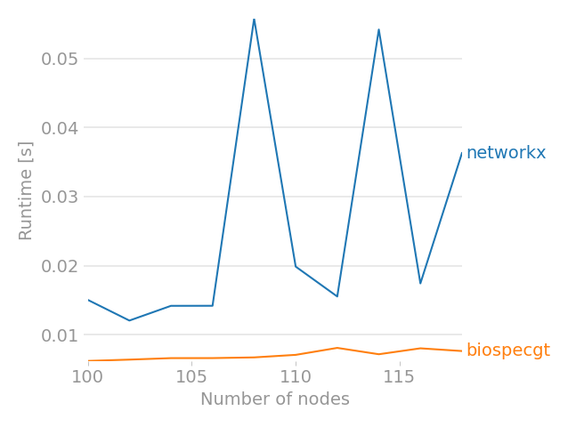

# BioSpecGT
Spectral graph theory for Biological network analysis

* Guarantees high-performance by using Cython
* Friendly interface, easy to use, verbose error messages
* ???
* Profit


### Comparison to networkx
* Random generation of a regular graph



## Usage
For the full documentation, see the [docs](https://requests.readthedocs.io/en/master/).

### Graph creation
 ```python
from BioSpecGT.biospecgt.graph.generator import complete_graph
g = complete_graph(n=100)
```

### Graph algorithms
 ```python
from BioSpecGT.biospecgt.graph.generator import complete_graph
from BioSpecGT.biospecgt.utils.graphutils import minimum_spanning_tree

g = complete_graph(n=100)
msp = minimum_spanning_tree(g)
```


### Spectral graph theory
```python
from BioSpecGT.biospecgt.linalg.spectral import laplacian_matrix
from BioSpecGT.biospecgt.graph.generator import k_regular_graph

g = k_regular_graph(n=100, k=20, selfloop=False)
l = laplacian_matrix(g)
```

### Spectral clustering
 ```python
from BioSpecGT.biospecgt.graph.generator import complete_graph
g = complete_graph(n=100)
```

### Importing datasets
 ```python
from BioSpecGT.biospecgt.graph.generator import complete_graph
g = complete_graph(n=100)
```


### Co-expression networks
```python
from BioSpecGT.biospecgt.bio.coexpression import build_coexpr
from BioSpecGT.biospecgt.bio.base import top10_genes

# gene expression matrix
data = ...

c = build_coexpr(data)
print('Top 10 co-expressed genes:')
print('\n'.join(top10_genes(c)))
```


### Vizualization
 ```python
from BioSpecGT.biospecgt.graph.generator import complete_graph
g = complete_graph(n=100)
```
